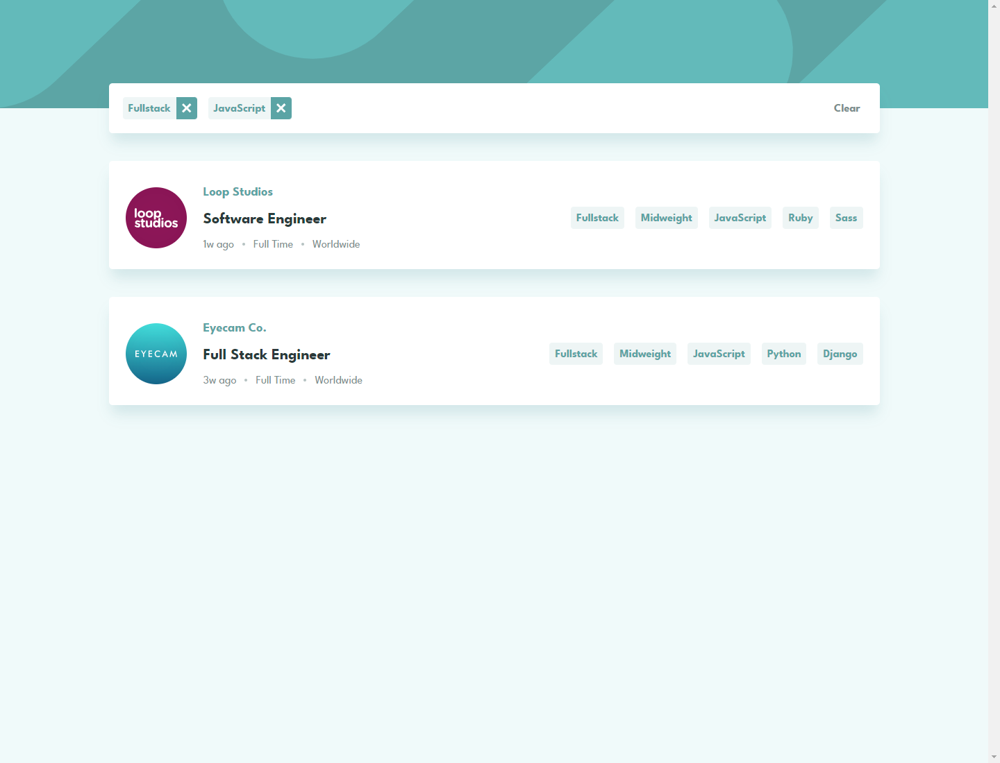

# Frontend Mentor - Job listings with filtering solution

This is a solution to the [Job listings with filtering challenge on Frontend Mentor](https://www.frontendmentor.io/challenges/job-listings-with-filtering-ivstIPCt). Frontend Mentor challenges help you improve your coding skills by building realistic projects.

## Table of contents

- [Overview](#overview)
  - [The challenge](#the-challenge)
  - [Screenshot](#screenshot)
  - [Links](#links)
- [My process](#my-process)
  - [Built with](#built-with)
  - [What I learned](#what-i-learned)
  - [Continued development](#continued-development)
  - [Useful resources](#useful-resources)
- [Author](#author)

## Overview

### The challenge

Users should be able to:

- View the optimal layout for the site depending on their device's screen size
- See hover states for all interactive elements on the page
- Filter job listings based on the categories

### Screenshot



### Links

- Solution URL: [https://github.com/miranlegin/fem-job-listings-with-filtering](https://github.com/miranlegin/fem-job-listings-with-filtering)
- Live Site URL: [https://frontend-mentor-challenge-24.netlify.app/
  ](https://frontend-mentor-challenge-24.netlify.app/)

## My process

### Built with

- [React](https://reactjs.org/) - JS library
- SCSS
- Flexbox
- CSS Grid

### What I learned

I learned how to apply filtering with multiple tags using react useState hook.

```js
const [role, setRole] = useState(null);
const [level, setLevel] = useState(null);
const [languages, setLanguages] = useState([]);
const [tools, setTools] = useState([]);
const [filterCounter, setFilterCounter] = useState(0);
```

### Continued development

There are couple of other challenges that complement this challenge nicely and my goal is to further enhance knowledge on searching/filtering with React.

## Author

- Frontend Mentor - [@miranlegin](https://www.frontendmentor.io/profile/miranlegin)
